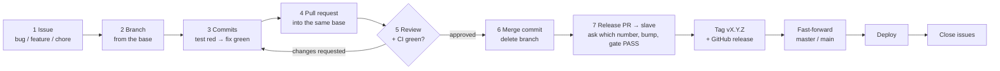

# GitHub workflow — from issue to release

**Applies to:** `dzzlo_oms_api`, `dzzlo_oms_app`, `dip-web`, `dzzlo_ro_web` (all under `github.com/ShikhaR-C`).
**Related:** [HOTFIX runbook](../oms_api/HOTFIX.md) · [Release gate (tasks_12 phase 6)](../tasks/tasks_12_tdd_testing/06-phase-6-release-gate.md) · [TDD daily workflow (tasks_12 phase 7)](../tasks/tasks_12_tdd_testing/07-phase-7-tdd-daily-workflow.md) · [FigJam board](https://www.figma.com/board/kZ7WmRqqYzrmx5tN8ulqCE) · [FigJam AI prompt for this flow](./01-figjam-ai-prompt.md)

---

## 0. The whole flow on one page



| Step | You make                           | Its name looks like                                               |
| ---- | ---------------------------------- | ----------------------------------------------------------------- |
| 1    | an **issue**                       | `ledger: opening balance restates from 0 across a FY`             |
| 2    | a **branch** off the base          | `fix/37-fy-opening-balance`                                       |
| 3    | **commits** (test first)           | `test(ledger): … — red` then `fix(ledger): … — green`             |
| 4    | a **PR** into the base             | `fix(ledger): keep the opening balance across an empty FY`        |
| 5    | a **review** (approve / changes)   | comments start `blocker:` `question:` `suggestion:` `nit:`        |
| 6    | a **merge commit**                 | `Merge PR #45: opening balance across an empty FY`                |
| 7    | a **release PR**, **tag**, release | PR `release: v1.6.0` · tag `v1.6.0` · title `v1.6.0 (2026-09-30)` |

> [!important] TDD in every repo — confirmed 2026-09-23
> API, app, dip-web and ro-web all follow test-driven development. **Any change that alters behaviour (a feature, a bugfix or a hotfix) starts with a failing test**, committed on its own (`— red`) before the code that makes it pass (`— green`). A refactor changes no behaviour, so it gets no new test: the suite is green before and after and no assertion changes. Chores and docs need no test. The per-repo rituals are in [tasks_12 phase 7](../tasks/tasks_12_tdd_testing/07-phase-7-tdd-daily-workflow.md) and each repo's `docs/testing.md`. A PR without its red commit is sent back in review (§6.2).

---

## 1. The branches that always exist

| Branch                                         | Role                                                                                                                                                                 | Who writes to it                                                 |
| ---------------------------------------------- | -------------------------------------------------------------------------------------------------------------------------------------------------------------------- | ---------------------------------------------------------------- |
| `master` (API) / `main` (app, dip-web, ro-web) | **Production.** The default branch on GitHub. Always equals the last release. The production servers pull this branch (D3).                                          | Only a fast-forward at release time (§8). Never a direct commit. |
| `slave`                                        | **Integration.** Everyday PRs land here; the release is cut from here.                                                                                               | Merged PRs only.                                                 |
| `slave_dev` (dip-web, ro-web only)             | Pre-integration for the web repos: feature PRs → `slave_dev` → `slave`.                                                                                              | Merged PRs only. Kept for now (D7).                              |
| `release/v1_79`                                | **Release branch** for one app release line (the `v1_79/` workspace folder). Collects the work planned for that release when `slave` must stay releasable meanwhile. | Merged PRs only. Deleted after the release.                      |
| `epic/<name>`                                  | **Epic branch** for large work that ships as one piece (today: `api_v4_foundations`, `app_v4_foundations`, `web_v4_foundations`). Child PRs stack on it.             | Merged PRs only.                                                 |

Today `slave` and `master` point at the same commit in the API and dip-web; in the app `slave` is 10 commits ahead of `main` (the TDD safety net merged after v1.78). Check before a hotfix — §9 depends on it:

```bash
git fetch origin
git rev-list --count origin/master..origin/slave   # API; use origin/main in the other repos. 0 = slave holds nothing unreleased
```

---

## 2. Step 1 — Create the issue

**Every piece of work starts as an issue** in the repo where the work starts (usually the API). Work that touches several repos gets one issue per repo, each linking the others (`Part of ShikhaR-C/dzzlo_oms_api#37`).

### 2.1 Which kind

| Kind                | Use when                                                                  | Label                                                |
| ------------------- | ------------------------------------------------------------------------- | ---------------------------------------------------- |
| **Bug**             | something that worked, or should work, gives a wrong result               | `bug`                                                |
| **Feature request** | a user should be able to do something new                                 | `enhancement`                                        |
| **Chore / docs**    | dependencies, CI, tooling, refactor, documentation                        | `documentation` for docs; none for chores            |
| **Hotfix**          | a bug that is **live in production** and cannot wait for the next release | `bug`, with **Priority: P0/P1 — hotfix** in the body |

Only GitHub's **default labels** are used for now (D4): `bug`, `enhancement`, `documentation`, plus `question`, `duplicate`, `invalid` and `wontfix` when closing. Custom labels and milestones come later.

### 2.2 Title format

```
<area>: <what is wrong, or what the user can do — in plain words>
```

- **area** = the module or screen, lowercase: `ledger`, `orders`, `so`, `voc`, `credit`, `customers`, `daily-summary`, `veh_trns`, `auth`, `perf`, `ci`, `docs`.
- Bug: describe the **symptom**, not the fix. ✅ `ledger: updateBal restates from 0 across a financial year with no opening row` (#37). ❌ `fix updateBal`.
- Feature: describe the **outcome**. ✅ `customers: sort the list by latest order`. ❌ `new sort API`.

### 2.3 Label, priority, assignee

- **Label** from §2.1 (at most one).
- **Priority**, written in the body's _Priority_ section until priority labels exist (D4): `P0` production down or money/ledger wrong → hotfix now · `P1` a main flow broken, no workaround → hotfix or this week · `P2` normal → next release · `P3` nice to have → backlog.
- **Release**: say which release it is planned for (`v1.79`) in the body. There are no milestones yet (D4).
- **Assignee** = whoever will make the branch.

### 2.4 Issue body

Copy the matching body below into the issue. Issue templates in the repos come later (D5).

**Bug**

```markdown
### What happened

### What should happen

### Steps to reproduce

1. Role / company / screen …
2. …

### Where

repo · endpoint or screen · app version (e.g. Android 1.78 (103)) · API version (e.g. 1.5.4)

### Evidence

screenshot, request, log line, affected ids

### Priority

P0 / P1 / P2 / P3 — and why (P0/P1 live in production = hotfix)

### Planned for

v1.79 / next release / backlog
```

**Feature request**

```markdown
### Who needs it and why

### Story

As a <role>, I want <capability> so that <benefit>.

### Acceptance criteria (each one becomes a red test first)

- [ ] …

### Repos touched

api / app / dip-web / ro-web

### Out of scope
```

**Chore / docs** — what, why now, and what "done" looks like.

```bash
gh issue create -R ShikhaR-C/dzzlo_oms_api \
  --title "ledger: opening balance restates from 0 across an empty financial year" \
  --label bug --body-file issue.md
```

---

## 3. Step 2 — Create the branch

### 3.1 Where to branch from = where the PR will go

| Work                                               | Branch from                | PR base (§5)    |
| -------------------------------------------------- | -------------------------- | --------------- |
| Normal bug or feature, no release branch open      | `slave` (web: `slave_dev`) | same            |
| Work planned for an open release (`release/v1_79`) | `release/v1_79`            | `release/v1_79` |
| Part of an epic                                    | `epic/<name>`              | `epic/<name>`   |
| Next step of a stacked series (§5.4)               | the PR below it            | the PR below it |
| **Hotfix** (live in production)                    | `master` / `main`          | see §9          |

**The rule of thumb: the PR goes back into the branch you started from.**

### 3.2 Branch name format

```
<type>/<issue#>-<short-kebab-name>
```

| type        | for                              | example                               |
| ----------- | -------------------------------- | ------------------------------------- |
| `feature/`  | a new capability                 | `feature/52-daily-summary-date-range` |
| `fix/`      | a bug found before release       | `fix/37-fy-opening-balance`           |
| `hotfix/`   | a bug live in production         | `hotfix/41-ist-dates`                 |
| `chore/`    | dependencies, CI, tooling        | `chore/60-upgrade-mongoose`           |
| `docs/`     | documentation only               | `docs/61-v4-test-idiom`               |
| `test/`     | tests only                       | `test/62-ledger-regression`           |
| `refactor/` | no behaviour change              | `refactor/63-split-voc-controller`    |
| `perf/`     | speed / scale                    | `perf/64-customers-indexes`           |
| `design/`   | app UI polish (app repo)         | `design/65-credit-sheet-type-scale`   |
| `release/`  | a release line — no issue number | `release/v1_79`                       |
| `epic/`     | an epic — no issue number        | `epic/v4-foundations`                 |

- Lowercase, words joined with `-`, 2–5 words after the number.
- **One feature across repos → the same branch name in every repo** (precedent: `feature/db-driven-version-gate` in API, app and dip-web). Each repo's issue number goes in its own repo; if the numbers differ, use the API's.
- Existing branches keep their names; this applies to new ones.

```bash
# Option A — links the branch to the issue on GitHub (shows under "Development")
gh issue develop 37 --base slave --name fix/37-fy-opening-balance --checkout

# Option B — plain git
git fetch origin
git switch -c fix/37-fy-opening-balance origin/slave
git push -u origin fix/37-fy-opening-balance
```

---

## 4. Step 3 — Commit

```
<type>(<scope>): <what changed, imperative, lowercase>
```

- **type**: `feat` `fix` `test` `docs` `chore` `refactor` `perf` (same list as branches; `feature/` branch → `feat` commit).
- **scope**: the area, with the API version when it matters — `ledger`, `v4/customers`, `v4/perf`.
- Keep the subject short (dip-web's CI flags subjects over 72 characters); detail goes in the body.
- **TDD pair (every repo, every feature, bugfix and hotfix):** at least two commits, test first:
  ```
  test(ledger): opening balance survives a FY with no activity — red
  fix(ledger): carry the opening balance across an empty FY — green
  ```
  The red commit proves the test catches the bug or pins the new behaviour (PR checklist, first line). Bigger work repeats the pair once per behaviour: `test(v4/customers): … — red` → `feat(v4/customers): … — green` → the next pair.
- Mention the issue in the body when useful: `Refs #37`.

Stay up to date with the base by **merging** it in (`git merge origin/slave`), not rebasing, once a review has started — a force-push hides what the reviewer already saw.

---

## 5. Step 4 — Open the pull request

### 5.1 Base

The base is the branch you branched from (§3.1). Double-check it in the PR screen before you press **Create** — `master` is the GitHub default and is almost never right.

### 5.2 Title

```
<type>(<scope>): <summary>                         ← normal
<type>(<scope>): <summary> (stacked on #NN)        ← stacked
release: v1.6.0                                    ← API / web release PR
release: v1.79 (Android 104 / iOS 10)              ← app release PR
```

Examples from history: `fix(ledger): read month, financial year and the FY fallback in IST` (#41) · `feat(v4): Daily Summary screen API — screen 02's read model (stacked on #40)` (#42).

### 5.3 Body

```markdown
## What & why

Refs #37 — <one or two sentences>

## Changes

- …

## Tests

- red run: <commit sha> fails, <commit sha> passes
- suite: before → after (e.g. 52 suites / 161 passing)

## Deploy notes

- API contract changed? fixtures:export done / front-end pull needed in <repo>
- Index or migration to run before deploy? (e.g. "build the Atlas indexes first", #43)
- Old app versions still in the field — do they keep working? (version gate / compat shim)
- None

## Testing checklist

<the repo's PULL_REQUEST_TEMPLATE checklist — ticked>
```

Use **`Refs #37`, not `Closes #37`**: GitHub auto-closes an issue only when the PR merges into the **default** branch (`master`/`main`), and our PRs merge into `slave`, so `Closes` would do nothing. Issues are closed at release (§8, step 8).

```bash
gh pr create --base slave --title "fix(ledger): carry the opening balance across an empty FY" --body-file pr.md
gh pr create --draft …     # still in progress — CI runs, nobody is asked to review yet
```

### 5.4 Big work — stacked PRs

When a change is too big to review in one go, split it: each PR is based on the branch of the PR below it, and says `(stacked on #NN)` in its title. Precedent: #43 → #42 → #40 → `api_v4_foundations`.
Merge from the **top down**: #43 into #42's branch, then #42 into #40's, then #40 into its base. The last merge commit names the PRs it carries: `Merge PR #40: Customers screen … (with #42's Daily Summary and #43's v4 performance work)`.

### 5.5 CI must be green

Every PR runs `.github/workflows/test.yml` — API `Jest (seed → jest → uproot)`, app `Jest`, dip-web/ro-web `test` + `lint` + `review-commits`. **Never merge on a red check.** GitHub does not enforce this on our plan (D6), so it is on the author and the reviewer.

---

## 6. Step 5 — Review

### 6.1 Before asking for review (author)

- [ ] PR base, title and branch name follow §3 and §5
- [ ] CI green; `yarn test` (API: `yarn test:full`) green locally
- [ ] Read your own diff on GitHub once, top to bottom
- [ ] Draft → **Ready for review**, reviewer requested

### 6.2 What the reviewer checks

| Area              | Question                                                                                                                                                                                                                                    |
| ----------------- | ------------------------------------------------------------------------------------------------------------------------------------------------------------------------------------------------------------------------------------------- |
| Scope             | Does it do what the issue asked, and nothing else?                                                                                                                                                                                          |
| Tests (TDD)       | Feature, bugfix or hotfix: is there a `— red` test commit **before** the code commit, and does the test fail without the change? Refactor: are the assertions unchanged? No test deleted or `.skip`ped without a reason in the description? |
| API rules (AI.md) | New contracts only in `api_v4/`; `api_v3/` only test-first bugfixes; `api_v1/`, `api_v2/`, `models/` unchanged; `helpers/` only new, approved files                                                                                         |
| v4                | One tenancy test per id the body accepts                                                                                                                                                                                                    |
| Contract          | Response shape changed → fixtures exported and the front-end pull noted                                                                                                                                                                     |
| Old apps          | Do app versions still in the field keep working?                                                                                                                                                                                            |
| Data              | New index / migration / backfill → the deploy step is written in the PR                                                                                                                                                                     |
| Safety            | No secrets, `.env` values, stray `console.log`, or production ids                                                                                                                                                                           |
| Names             | Branch, commits and title follow this page                                                                                                                                                                                                  |

### 6.3 How to comment

Start each comment with what it is, so the author knows what must change:

| Prefix        | Meaning                            | Must the author act? |
| ------------- | ---------------------------------- | -------------------- |
| `blocker:`    | wrong, unsafe, or breaks something | yes, before merge    |
| `question:`   | I don't understand this            | answer it            |
| `suggestion:` | a better way, your call            | reply either way     |
| `nit:`        | style / wording                    | optional             |

Finish with one of: **Approve** · **Request changes** (any `blocker:`) · **Comment**.
The author answers every thread and pushes fixes as new commits, then re-requests review. The **reviewer** resolves the threads they opened.

```bash
gh pr checks 45
gh pr review 45 --approve
gh pr review 45 --request-changes --body "blocker: …"
```

Needs **1 approval** from someone who did not write it. When nobody else is available, the author runs `/code-review` in Claude Code on the branch and works through its findings before merging, and says so in the PR.

---

## 7. Step 6 — Merge

- **Who:** the author, after the approval and a green CI.
- **How:** **Create a merge commit** — never squash or rebase. The red → green commits are the TDD proof and must survive into history.
- **Merge commit subject:** `Merge PR #<n>: <the change in plain words>`.
- **Delete the branch** after merge (`feature/`, `fix/`, `hotfix/` …). Never delete `master`/`main`, `slave`, `slave_dev`, or an open `release/` / `epic/` branch.
- **On the issue:** comment `Merged into slave in #45 — ships in v1.79.` and leave it open until the release (§8 closes it).

```bash
gh pr merge 45 --merge --subject "Merge PR #45: opening balance across an empty FY" --delete-branch
```

---

## 8. Step 7 — Release and tag

### 8.1 Versions and tags

| Repo                 | Version lives in                           | Tag                                           | Release title                                                                              |
| -------------------- | ------------------------------------------ | --------------------------------------------- | ------------------------------------------------------------------------------------------ |
| API, dip-web, ro-web | `package.json` `"version"`                 | `vX.Y.Z` e.g. `v1.6.0`                        | `vX.Y.Z (YYYY-MM-DD)`                                                                      |
| App                  | native build (versionName/code, iOS build) | `vX.YY` e.g. `v1.79`                          | `vX.YY (YYYY-MM-DD)`                                                                       |
| Any hotfix           | **not bumped** unless someone asks (D1)    | `hotfix-<short-name>` e.g. `hotfix-ist-dates` | `hotfix(<scope>): <short-name> (YYYY-MM-DD)` e.g. `hotfix(ledger): ist-dates (2026-09-10)` |

If a hotfix bump _is_ asked for, it becomes a normal `vX.Y.Z` tag and title.

**Which number goes up is asked every time, never assumed (D2).** Before bumping, ask the release owner: X, Y or Z? For reference when answering: X (major) when older apps can no longer talk to the API · Y (minor) for new features · Z (patch) for fixes. So far every API release bumped Z (1.5.0 → 1.5.4, features included).

### 8.2 Release steps (planned release)

1. **Freeze**: everything planned for `v1.79` is merged into `release/v1_79` (or into `slave` if there is no release branch). Anything not ready moves to the next release, and its issue says so.
2. **Ask which number to bump** (X, Y or Z, §8.1), then bump it on the release branch in its own commit: `chore(release): bump v1.6.0` (app: `chore(release): bump v1.79 build (android 104, ios 10)`).
3. **Run the release gate** from the workspace folder — it must say `RELEASE GATE: PASS`:
   ```bash
   bash dzzlo_oms_api/scripts/release_gate.sh   # fixtures fresh → api test:full → dip-web → app
   ```
   (ro-web is not in the gate yet: run `yarn test` there.) A red gate moves the release date, not the bar ([policy](../tasks/tasks_12_tdd_testing/06-phase-6-release-gate.md#62-the-policy--written-absolute)).
4. **Open the release PR** `release/v1_79 → slave`, title `release: v1.6.0`, body = the release checklist from `docs/testing.md` §9 + the compatibility line.
5. **Review and merge** it as in §6–§7 (merge commit).
6. **Tag and publish the GitHub release** on `slave`:
   ```bash
   gh release create v1.6.0 --target slave --title "v1.6.0 (2026-09-30)" --notes-file release-notes.md
   ```
7. **Move production** — fast-forward `master`/`main` to `slave` (it must be a fast-forward; if it refuses, `master` has something `slave` doesn't — stop and find out):
   ```bash
   git fetch origin
   git switch master && git merge --ff-only origin/slave && git push origin master
   ```
8. **Deploy and close**:
   - API: the servers pull `master` and restart ([AWS runbook, Phase 3](../oms_api/DZZLOOMS_backend_AWS.md)).
   - App: build from `main` and submit to the stores.
   - Web: build from `main` and publish.
   - Then close every issue the release's PRs referenced, with `Released in v1.6.0`. Delete `release/v1_79` and tell the team.

### 8.3 Release notes format

```markdown
<version> is here.

Compatible with:
Android - 1.79 (104) · iOS - 1.79 (10) · DIP-Web - 1.4.8 · API - 1.6.0

## What's Changed

### <Area>

- <user-visible change> (#PR)

## Tests

<suites / passing, before → after; gate PASS on <sha>>

## Deploy notes

<indexes, migrations, env changes — or "none">

Merged via PR #<n> into `slave`.
```

A hotfix's notes end with `Hotfix shipped without a package.json version bump (stays at 1.5.4).`, as `hotfix-ist-dates` does.

---

## 9. Hotfix path (bug live in production)

Full command-by-command runbook: [HOTFIX.md](../oms_api/HOTFIX.md). The shape:

1. Issue labelled `bug`, with **Priority: P0/P1 — hotfix** in the body.
2. Branch `hotfix/<issue#>-<name>` from `master`/`main` (what is live).
3. Failing test first (`— red`), then the fix (`— green`). **No version bump** unless someone asks for one (D1).
4. Where the PR goes depends on §1's check:
   - **`slave` holds nothing unreleased** (usual for the API): PR into `slave` → merge → tag `hotfix-<name>` on `slave` → fast-forward `master` → deploy. This is how #32, #36 and #41 shipped.
   - **`slave` holds unreleased work** (usual for the app): PR into `master`/`main` → merge → tag on `master`/`main` → deploy → then open `master → slave` so `slave` gets the fix too. Otherwise the hotfix would carry the unreleased work into production with it.
5. Close the issue: `Released in hotfix-<name> (YYYY-MM-DD)`.

---

## 10. Naming cheat sheet

| Thing            | Format                                                                      | Example                                                         |
| ---------------- | --------------------------------------------------------------------------- | --------------------------------------------------------------- |
| Issue title      | `<area>: <symptom or outcome>`                                              | `ledger: opening balance restates from 0 across a FY`           |
| Label            | GitHub default: `bug` / `enhancement` / `documentation`                     | `bug` (priority goes in the body)                               |
| Branch           | `<type>/<issue#>-<short-kebab>`                                             | `fix/37-fy-opening-balance`                                     |
| Release branch   | `release/v<major>_<minor>`                                                  | `release/v1_79`                                                 |
| Epic branch      | `epic/<name>`                                                               | `epic/v4-foundations`                                           |
| Commit           | `<type>(<scope>): <imperative summary>`                                     | `fix(ledger): carry the opening balance across an empty FY`     |
| TDD commit pair  | `… — red` then `… — green`                                                  | `test(ledger): … — red` / `fix(ledger): … — green`              |
| PR title         | `<type>(<scope>): <summary>` [`(stacked on #NN)`]                           | `feat(v4): Daily Summary screen API (stacked on #40)`           |
| Release PR title | `release: vX.Y.Z` (app: `release: vX.YY (Android n / iOS n)`)               | `release: v1.6.0`                                               |
| Merge commit     | `Merge PR #<n>: <plain words>`                                              | `Merge PR #41: IST date rules for the ledger`                   |
| Tag              | `vX.Y.Z` (app `vX.YY`) · hotfix `hotfix-<short-name>`                       | `v1.6.0`, `v1.79`, `hotfix-ist-dates`                           |
| Release title    | `vX.Y.Z (YYYY-MM-DD)` · hotfix `hotfix(<scope>): <short-name> (YYYY-MM-DD)` | `v1.6.0 (2026-09-30)`, `hotfix(ledger): ist-dates (2026-09-10)` |
| Review comment   | `blocker:` / `question:` / `suggestion:` / `nit:`                           | `blocker: this reads the host's zone, not IST`                  |

---

## 11. Decisions (answered 2026-09-23)

| #   | Question                           | Answer                                                                                                                                                                                                                                                                                        |
| --- | ---------------------------------- | --------------------------------------------------------------------------------------------------------------------------------------------------------------------------------------------------------------------------------------------------------------------------------------------- |
| D1  | Does a hotfix bump the version?    | **No, unless someone asks.** Tag `hotfix-<short-name>`, title `hotfix(<scope>): <short-name> (YYYY-MM-DD)`, as the last four hotfixes did. A requested bump makes it a normal `vX.Y.Z` release.                                                                                               |
| D2  | Which number does a release bump?  | **Ask every time** (X, Y or Z) before bumping; never assume.                                                                                                                                                                                                                                  |
| D3  | Which branch is production?        | **`master` or `main`, whichever the repo has**: `master` in the API, `main` in the app, dip-web and ro-web. The servers and store builds take that branch.                                                                                                                                    |
| D4  | Custom labels and milestones?      | **Not now.** GitHub's default labels only; priority and target release go in the issue body. To be revisited later.                                                                                                                                                                           |
| D5  | Issue templates in the repos?      | **Not now.** Copy the §2.4 bodies by hand. To be added later.                                                                                                                                                                                                                                 |
| D6  | Branch protection?                 | **Left as it is.** GitHub refuses branch protection and rulesets on these private repos on a free account (_"Upgrade to GitHub Pro or make this repository public to enable this feature"_). The rules in §5–§8 (PR only, green CI, review before merge, no force-push) are followed by hand. |
| D7  | Keep `slave_dev` in the web repos? | **Kept for now.** dip-web and ro-web go feature → `slave_dev` → `slave`.                                                                                                                                                                                                                      |
